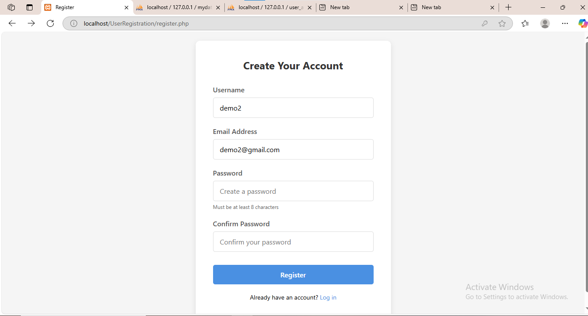
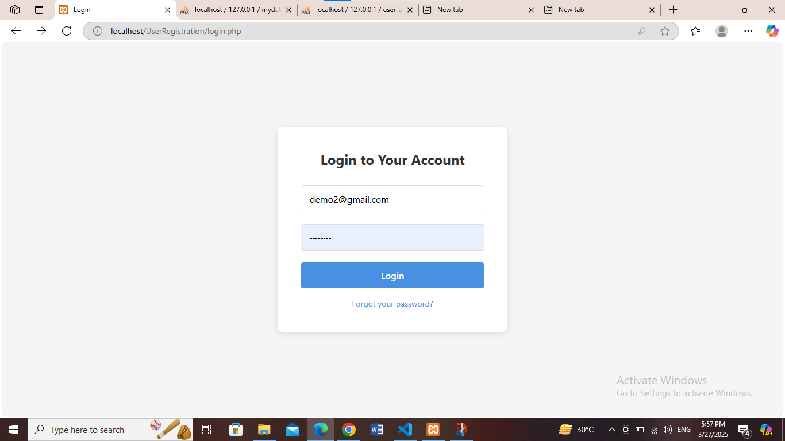
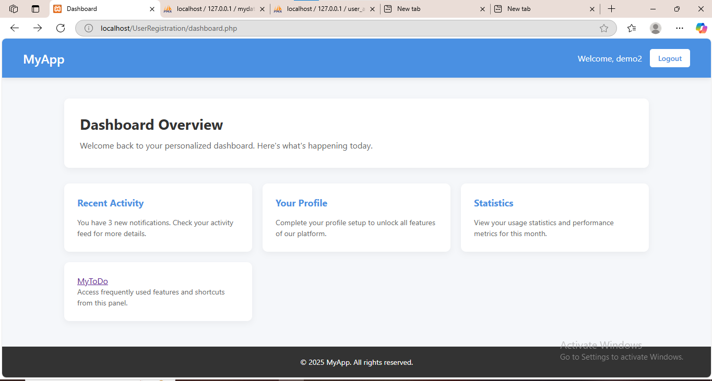

### **User Registration & Login System** 🛡️🔐  

Our **User Registration & Login System** is a simple yet powerful authentication system built using **PHP & MySQL**. It allows users to **register**, **log in**, and securely manage their accounts.  

---

## 🌟 **Key Features:**  
✅ **User Registration** – Users can create accounts with a **username, email, and password**.  
✅ **Secure Password Handling** – Passwords are encrypted using **password_hash()** for enhanced security.  
✅ **User Login & Authentication** – Users can log in securely using their credentials.  
✅ **Session Management** – Keeps users logged in across pages.  
✅ **Error Handling & Validation** – Ensures data integrity and prevents SQL injection.  

---

## 🛠️ **Tech Stack Used:**  
🔹 **PHP** – Backend logic  
🔹 **MySQL** – Database management  
🔹 **HTML/CSS** – Basic frontend UI  
🔹 **XAMPP** – Local development environment  

---

## 🚀 **How It Works:**  
1️⃣ **User registers** with a username, email, and password.  
2️⃣ **Data is stored** securely in the MySQL database.  
3️⃣ **User logs in** using email & password.  
4️⃣ **Password is verified**, and the session starts.  
5️⃣ **Redirects to a dashboard** after successful login.  

---

This system is perfect for **small projects, learning authentication, or as a base for bigger web applications**. 🎯  

Want to try it out? Set it up using **XAMPP** or host it online! 🚀

